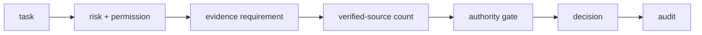

# Architecture

## Task store
Stores task description, risk, required permission, evidence count, and status.

## Permission registry
Separates agent identity from granted capabilities.

## Evidence registry
Tracks source-specific verified evidence per task.

## Authority gate
Maps risk, permission, and evidence to ACT/ASK/VERIFY/ESCALATE.

## Audit
Records task creation, evidence events, and decisions.

## Design principle
Capability is not authority. Every consequential action should be bounded by explicit permission, evidence, and risk.
